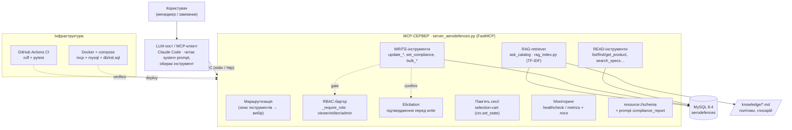

# Архітектура проєкту AeroDefences MCP

Повний опис: як усе працює, який скрипт за що відповідає і що з чим з'єднано.

> Проєкт — навчальна вправа з «архітектури контексту»: MCP-сервер (FastMCP)
> над реальною MySQL-базою `aerodefences` (каталог компонентів БПЛА).
> Крім робочого сервера тут лежить набір мінімальних прикладів («грані»
> контексту MCP) — по одній парі `server_*.py` / `client_*.py` на кожну грань.

---

## 1. Загальна картина

```
┌─────────────────────────────────────────────────────────────────────────┐
│  КОРИСТУВАЧ                                                                │
│  (Ірина в чаті / автотест)                                                 │
└───────────────┬───────────────────────────────────────────────────────────┘
                │ природна мова: «сними edgenode-ai з публікації»
                ▼
┌───────────────────────────────┐        Хто грає роль «клієнта MCP»:
│  LLM / MCP-ХОСТ               │        • справжній Claude Code (через .mcp.json)
│  (Claude Code)                │        • client_aerodefences.py (harness, без LLM)
│                               │        • repl_aerodefences.py (ручний REPL)
│  обирає інструмент +          │
│  збирає аргументи             │
└───────────────┬───────────────┘
                │ JSON-RPC поверх stdio
                │ (запуск сервера як підпроцес)
                ▼
┌───────────────────────────────────────────────────────────────────────────┐
│  MCP-СЕРВЕР  ·  server_aerodefences.py  ·  FastMCP                          │
│                                                                            │
│   resource://schema        list_products      find_products                │
│   get_product              export_specs       set_product_status (WRITE)   │
│                                                                            │
│   Кожен інструмент отримує ctx: Context (логи, elicit, progress)           │
│   Доступ до БД:  _run_query (read)  /  _run_write (write, commit)           │
│   Блокуючий pymysql загорнутий у asyncio.to_thread                          │
└───────────────┬───────────────────────────────────────────────────────────┘
                │ pymysql, DictCursor
                │ host 127.0.0.1:3306, user aerodefence / db aerodefences
                ▼
┌───────────────────────────────────────────────────────────────────────────┐
│  MySQL 8.4  ·  Docker-контейнер add-mysql-1                                 │
│  Таблиці: products, categories, product_specs / _features / _faqs /        │
│           _use_cases / _images / _relations / _sections, menus, urls, ...   │
│  Сусідні контейнери: add-backend-1 (:8080), add-frontend-1 (:8081)         │
└───────────────────────────────────────────────────────────────────────────┘
```

Ключова ідея: **сервер не «спілкується» з людиною**. Він лише публікує
інструменти й ресурси. Хто саме їх викликає — жива LLM чи тестовий harness —
серверу байдуже. Тому один і той самий `server_aerodefences.py` працює і в
автотесті, і в справжньому Claude.

---

## 2. Життєвий цикл одного виклику (end-to-end)

На прикладі «сними edgenode-ai з публікації»:

1. **Користувач** пише запит природною мовою.
2. **LLM/хост** зіставляє запит з описом інструмента `set_product_status`
   (за змістом, не за ключовими словами), витягує з контексту `slug="edgenode-ai"`
   і `status="draft"` та генерує структурований виклик.
3. **MCP-клієнт** серіалізує виклик у JSON-RPC і надсилає серверу через **stdio**
   (клієнт сам підняв сервер як підпроцес — див. `Client("./server_aerodefences.py")`).
4. **FastMCP** приймає повідомлення, валідує аргументи за JSON-схемою інструмента
   (типи `slug: str`, `status: str`) і викликає Python-функцію
   `set_product_status(...)`, підставляючи `ctx: Context`.
5. **Тіло інструмента**:
   - валідує `status` за `ALLOWED_STATUSES`;
   - читає поточний рядок через `_run_query` (перевіряє, що продукт існує,
     і чи не збігається статус — тоді no-op);
   - **бар'єр безпеки**: `await ctx.elicit(...)` — запит підтвердження людині;
   - лише після «yes» викликає `_run_write` (UPDATE + `commit`).
6. **Відповідь** (`"OK: 'EdgeNode AI' published -> draft ..."`) повертається тим
   самим каналом назад до клієнта, а логи (`ctx.info`) — окремими
   notification-повідомленнями через `log_handler`.

Саме крок 5 (elicitation) — це той діалог Accept/Decline, який спливає перед
записом. Поки не натиснуто Accept, у БД нічого не змінюється.

---

## 3. Головні файли проєкту

| Файл | Роль | З чим з'єднаний |
|------|------|-----------------|
| **`server_aerodefences.py`** | Сам MCP-сервер: усі інструменти + ресурс над MySQL | ← клієнти (stdio); → MySQL (pymysql) |
| **`client_aerodefences.py`** | Harness — сценарний тест-клієнт замість LLM; ганяє всі інструменти по черзі й друкує результат | піднімає сервер підпроцесом |
| **`repl_aerodefences.py`** | Інтерактивний REPL — команди `call <tool> {json}` набираються вручну | піднімає сервер підпроцесом |
| **`.env` / `.env.example`** | Параметри підключення до БД (`ADD_DB_*`) | читає `server_aerodefences.py` через `dotenv` |
| **`.mcp.json`** | Реєстрація сервера в Claude Code (project-scope) | вказує Claude, як запустити сервер |
| **`README.md`** | Короткий огляд + запуск | — |
| **`context_scenario_aerodefences.md`** | Документ навчального завдання (галузь + сценарій контексту) | — |
| **`ARCHITECTURE.md`** | Цей файл — повний опис архітектури | — |

### 3.1. `server_aerodefences.py` — деталі

Структурні блоки (згори вниз):

- **`load_dotenv()` + `DB_CONFIG`** — параметри підключення з `.env` з дефолтами
  під контейнер `add-mysql-1`.
- **`_run_query` / `query`** — read-доступ. `query` загортає блокуючий pymysql
  у `asyncio.to_thread`, щоб не блокувати event loop.
- **`_run_write`** — write-доступ: `execute` + `commit`, повертає кількість
  змінених рядків.
- **`ALLOWED_STATUSES = ("draft","published","archived")`** — єдине джерело
  істини для валідації статусів (використовується в `find_products` і
  `set_product_status`).

Публічні сутності (те, що бачить LLM):

| Сутність | Тип | Що робить | Грань контексту |
|----------|-----|-----------|-----------------|
| `resource://schema` | resource | Віддає схему БД (з `information_schema`), щоб LLM оперувала реальними полями | **resources** |
| `list_products(limit)` | tool (read) | Опубліковані продукти (короткий список) | logging |
| `find_products(status, ndaa_compliant, made_in_usa, category, search, limit)` | tool (read) | Пошук за фільтрами; динамічний `WHERE`, `JOIN categories` | logging + фільтри |
| `get_product(slug)` | tool (read) | Повна картка: `products` + specs/features/use_cases/faqs/images | logging + обробка помилок |
| `list_categories()` | tool (read) | Категорії + кількість товарів у кожній | `categories` + `COUNT products` |
| `get_category(slug)` | tool (read) | Категорія + усі її товари | `categories`, `products` |
| `search_specs(search, limit)` | tool (read) | Пошук по назві/значенню характеристик | `product_specs` + `JOIN products` |
| `get_faqs(slug)` | tool (read) | Тільки FAQ продукту | `product_faqs` |
| `related_products(slug)` | tool (read) | Пов'язані продукти (compatible/accessory/...) | `product_relations` + `JOIN products` |
| `catalog_stats()` | tool (read) | Зведення: за статусами, категоріями, NDAA/USA | агрегати по `products` |
| `low_stock(threshold)` | tool (read) | Товари із залишком <= порогу (NULL відкинуто) | `products.stock_quantity` |
| `find_products_by_price(min_price, max_price)` | tool (read) | Ціновий діапазон (NULL відкинуто) | `products.price` |
| `export_specs()` | tool (read) | Вивантаження specs усіх продуктів; довга операція | **progress** |
| `set_product_status(slug, status)` | tool (**write**) | Змінює статус; підтвердження перед записом; аудит-логи | **elicitation** + write |
| `update_price(slug, price, currency?)` | tool (**write**) | Ціна (+валюта); read→confirm→write | elicitation + аудит |
| `update_stock(slug, quantity)` | tool (**write**) | Залишок на складі | elicitation + аудит |
| `set_compliance(slug, ndaa?, made_in_usa?)` | tool (**write**) | Прапорці NDAA / Made in USA (⚠️ compliance) | elicitation + аудит |
| `update_product_field(slug, field, value)` | tool (**write**) | Одне текстове поле — лише за `ALLOWED_UPDATE_FIELDS` | elicitation + білий список |
| `add_spec(slug, spec_group, spec_name, spec_value)` | tool (**write**) | Додає характеристику (`product_specs`) | elicitation |
| `add_faq(slug, question, answer)` | tool (**write**) | Додає FAQ (`product_faqs`) | elicitation |
| `reorder_product(slug, sort_order)` | tool (**write**) | Позиція у видачі | elicitation |
| `bulk_set_status(category, status)` | tool (**write**) | Масова зміна статусу за категорією (🔴 багато рядків) | elicitation + лічильник |

> Усі write-інструменти проходять спільний бар'єр **`_confirm(ctx, message)`** —
> хелпер поверх `ctx.elicit`, що повертає `(ok, reason)`. Патерн однаковий:
> валідація → читання поточного стану → `_confirm` (показує «було → стане») →
> `_run_write` (commit) → аудит-лог. Без явного `yes` у БД нічого не змінюється.

> ⚠️ Нюанс MySQL 8: `information_schema` повертає імена колонок у ВЕРХНЬОМУ
> регістрі — тому в ресурсі `schema` вони явно аліасяться в нижній
> (`TABLE_NAME AS table_name` тощо).

> ⚠️ Нюанс даних: усі ~15 продуктів NDAA-сумісні, тож
> `find_products(ndaa_compliant=False)` очікувано повертає 0 — це не баг.

### 3.2. `client_aerodefences.py` — harness

Показує повний тест-прогін **без LLM**. Реєструє три обробники, які роблять
клієнта «повноцінним співрозмовником» сервера:

- **`log_handler`** — друкує логи, що сервер шле через `ctx.info/ctx.debug`.
- **`progress_handler`** — показує відсотки довгих операцій (`export_specs`).
- **`elicitation_handler`** — відповідає на запити підтвердження. Читає ввід із
  термінала; якщо stdin недоступний (автотест) — автоматично відповідає `yes`.

Далі послідовно: `list_tools` → `list_products` → читання `resource://schema`
→ два `find_products` → `export_specs` (з прогресом) → `get_product` →
`set_product_status` **round-trip** (archived + повернення назад), щоб
протестувати запис, не псуючи дані.

### 3.3. `repl_aerodefences.py` — інтерактив

Той самий набір обробників, але замість сценарію — цикл `input()`:
команди `tools`, `schema`, `call <tool> {json}`, `quit`. Тут stdin доступний,
тому підтвердження надається **вручну по-справжньому**.

### 3.4. `.mcp.json` — місток до справжнього Claude

```json
{ "mcpServers": { "aerodefences": {
    "type": "stdio",
    "command": ".venv/bin/python",
    "args": ["server_aerodefences.py"] } } }
```

Коли цей файл є, Claude Code сам піднімає сервер і показує його інструменти
моделі. Тоді роль «клієнта» з розділу 1 грає вже не harness, а жива LLM —
і саме через цей шлях відбувалися зміни статусу EdgeNode AI у чаті.

---

## 4. Приклади-«грані» (навчальні пари server/client)

Це мінімальні самостійні демонстрації окремих можливостей MCP. Кожна пара
`server_X.py` + `client_X.py` запускається незалежно
(`.venv/bin/python client_X.py`) і ілюструє одну грань. Робочий
`server_aerodefences.py` зібраний саме з цих цеглинок.

| Пара | Грань | Що демонструє |
|------|-------|---------------|
| `server_context` / `client_context` | **context** | Базовий інструмент `greet` з `ctx.info` — мінімум, з чого все починається |
| `server_logging` / `client_logging` | **logging** | `ctx.debug/info` з `extra`; клієнт ловить логи через `log_handler` |
| `server_progress` / `client_progress` | **progress** | `ctx.report_progress` у циклі; клієнт малює відсотки |
| `server_elicitation` / `client_elicitation` | **elicitation** | Багатокрокове запитування (текст → число → enum yes/no) з дефолтами |
| `server_state` / `client_state` | **state** | `ctx.set_state/get_state/delete_state` — стан між викликами в межах сесії |
| `server_request` / `client_request` | **request** | `ctx.request_id/client_id/session_id` + клієнтська `meta` (user_id, trace_id) |
| `server_transport` / `client_transport` | **transport** | Поведінка залежно від `ctx.transport` (stdio vs http) |
| `server_notifications` / `client_notifications` | **notifications** | Сервер шле `*ListChanged`; клієнт ловить через `message_handler` |
| `server_access` / `client_access` | **resources/prompts** | Інструмент читає власні `resources` і `prompts` через `ctx.read_resource/get_prompt` |

**Відповідність граней робочому серверу:**

- logging → усі read-інструменти (`ctx.info`)
- resources → `resource://schema`
- progress → `export_specs`
- elicitation → `set_product_status` (підтвердження перед записом)
- errors → `get_product` / `set_product_status` (`raise ValueError` на невідомий slug/статус)

---

## 5. Як запускати

Передумови: MySQL-контейнер `add-mysql-1` піднятий на `127.0.0.1:3306`;
є `.venv` (створене через `uv`) з `fastmcp` + `pymysql`; налаштований `.env`.

```bash
cp .env.example .env            # за потреби відредагувати креденшли

# 1) Сценарний harness (повний автопрогін без LLM)
.venv/bin/python client_aerodefences.py

# 2) Інтерактивний REPL (ручні виклики, живий elicitation)
.venv/bin/python repl_aerodefences.py

# 3) Вбудований CLI FastMCP (треба .venv/bin у PATH)
fastmcp list server_aerodefences.py
fastmcp call server_aerodefences.py list_products '{"limit": 5}'

# 4) Веб-інспектор (потрібні node/npx; UI на :6274)
fastmcp dev inspector server_aerodefences.py

# 5) Справжній Claude Code — через .mcp.json (потрібне підтвердження в /mcp)
```

---

## 6. Ключові інваріанти й запобіжники

- **Валідація статусу** — тільки `draft/published/archived`, інакше `ValueError`.
- **Ідемпотентність** — якщо новий статус == поточний, запис не виконується.
- **Бар'єр підтвердження** — жоден write не відбувається без явного `yes`
  через `ctx.elicit` (Decline/Cancel → «скасовано», у БД без змін).
- **Аудит** — кожна зміна логується `from → to → affected` через `ctx.info`.
- **Не-блокуючий I/O** — pymysql завжди через `asyncio.to_thread`.
- **Конфіг через env** — жодних креденшлів у коді; усе з `.env` / `DB_CONFIG`.

---

## 7. Оновлена архітектура (v0.2): RAG, безпека, інфраструктура

Схема нижче рендериться прямо на GitHub. Редагована версія — `architecture.drawio`
(відкрити на [draw.io](https://app.diagrams.net)).



### 7.1. Джерела даних (три типи)

| Джерело | Тип | Де використовується |
|---|---|---|
| MySQL `aerodefences` | база даних | read/write-інструменти, RAG-корпус |
| `knowledge/*.md` | локальні файли | RAG-корпус (політики, терміни, глосарій) |
| клієнтські `meta` (роль, user_id) | зовнішній контекст запиту | RBAC, `whoami`, аудит |

### 7.2. RAG-шар (`rag_index.py`)

Сервер грає роль **retriever'а**: збирає корпус із БД (по продукту: описи +
specs + faqs) та локальних `knowledge/*.md` (ріже на секції за `##`), будує
in-memory TF-IDF індекс і на запит `ask_catalog(question, k)` повертає top-k
фрагментів із `doc_id`, `source`, `score`, `snippet`. Генерацію робить LLM-хост
**виключно** за цими фрагментами (grounding). Без важких залежностей — чистий
Python, детермінований, працює офлайн і в CI. Перебудова — `rebuild_rag_index`.

**Двомовність (EN-описи ↔ UA-запити).** Описи товарів у БД — англійською, а
запити й політики — українською. Щоб товари знаходились за укр-запитами,
`knowledge/synonyms.md` містить правила `тригери => укр-синоніми`, які
`_collect_db` **вписує в пошуковий текст документа товару** під час індексації
(за категорією/термінами). Сам `synonyms.md` — конфіг, у видачу як фрагмент не
потрапляє. Приклад ефекту: запит «магнітометр компас» тепер піднімає нагору
товари MagCore/SensCore з БД, а не лише глосарій.

### 7.3. Безпека (RBAC + guardrails)

- **Ролі:** `viewer` (лише читання) → `editor` (звичайні write) → `admin`
  (compliance-прапорці, масові дії). Роль береться з `meta.role` або env
  `ADD_ROLE` (дефолт `admin` локально; у Docker — `viewer`).
- **Бар'єр `_require_role`** спрацьовує в єдиному чокпоінті `_confirm` (і в
  `set_product_status`) — **до** діалогу підтвердження.
- Решта запобіжників — див. розділ 6 і `PROMPT_BOOK.md` (§3).

### 7.4. Моніторинг

- `healthcheck` — доступність БД, готовність RAG-індексу, аптайм, метрики
  (для liveness/readiness-проб).
- `metrics` — лічильники `writes_committed` / `writes_denied` + аптайм.
- Структуроване логування у stderr (рівень через `ADD_LOG_LEVEL`), щоб не
  заважати stdio-протоколу MCP у stdout.

### 7.5. Інфраструктура та CI/CD

- **`Dockerfile`** — образ сервера; за замовчуванням HTTP-транспорт
  (`ADD_TRANSPORT=http`), щоб контейнер був мережевим сервісом.
- **`docker-compose.yml`** — піднімає MySQL (seed із `db/init.sql`) + MCP-сервер
  однією командою `docker compose up --build`.
- **`db/init.sql`** — знеособлений dump схеми+даних для відтворюваності
  (у seed — фіктивні назви, як у документах).
- **`.github/workflows/ci.yml`** — на кожен push/PR: підняти MySQL-сервіс,
  залити seed, `ruff check`, `pytest`.
- **Транспорт:** `ADD_TRANSPORT=stdio` (локальний хост) або `http` (деплой);
  `ADD_HTTP_HOST` / `ADD_HTTP_PORT`.
