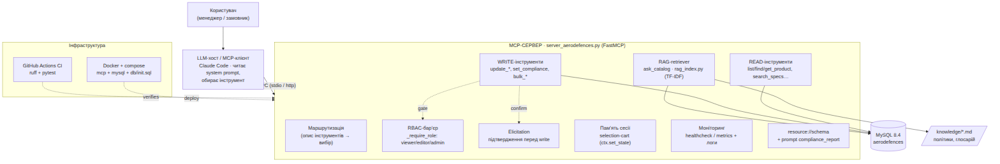

# AeroDefences MCP — курсовий проєкт

MCP-сервіс (FastMCP) над каталогом компонентів для БПЛА: політні контролери,
сенсори, навігація, живлення, оптичне/теплове payload. Сервер публікує для LLM
інструменти читання/зміни каталогу, RAG-пошук по даних і локальних політиках,
контроль доступу (RBAC), підтвердження небезпечних дій та моніторинг.

<!-- Після створення репо додати справжній URL, і бейдж почне показувати статус CI:
 -->

> **Бізнес-сценарій.** Корпоративна Q&A + керування каталогом: менеджер природною
> мовою питає про товари, наявність, сумісність і відповідність (NDAA / Made in
> USA), а також безпечно вносить зміни (ціна, склад, статус, тексти, FAQ) — усе
> через LLM-агента поверх MCP.

---

## 📦 Артефакти курсового

| Артефакт | Де |
|---|---|
| **Код MCP-сервера** | [`server_aerodefences.py`](server_aerodefences.py), [`rag_index.py`](rag_index.py) |
| **Технічна документація** | цей `README.md` + [`ARCHITECTURE.md`](ARCHITECTURE.md) |
| **Архітектурна схема** | [`docs/architecture.png`](docs/architecture.png) · редагована [`architecture.drawio`](architecture.drawio) · Mermaid у [ARCHITECTURE.md §7](ARCHITECTURE.md) |
| **Prompt Book** | [`PROMPT_BOOK.md`](PROMPT_BOOK.md) — системні промпти + guardrails |
| **Демонстрація** | [`DEMO.md`](DEMO.md) — сценарій + `🎥 <ВСТАВ_ПОСИЛАННЯ_НА_ВІДЕО>` |
| **Тести / CI** | [`tests/`](tests/), [`.github/workflows/ci.yml`](.github/workflows/ci.yml) |

---

## 🏗 Архітектура (огляд)



Агент (LLM-хост) звертається до MCP-сервера, який маршрутизує запити до
READ/WRITE-інструментів, RAG-retriever'а та памʼяті сесії; write-и проходять
барʼєр RBAC + підтвердження. Джерела — MySQL і локальні файли `knowledge/*.md`.
Розгортання — Docker/compose, перевірка — GitHub Actions CI.

Детально — [`ARCHITECTURE.md`](ARCHITECTURE.md); редагована схема —
[`architecture.drawio`](architecture.drawio).

---

## 🗺 Відповідність вимогам курсового

| Вимога (етап) | Реалізація |
|---|---|
| Логіка LLM + prompting | `PROMPT_BOOK.md`: системний промпт, стратегії маршрутизації, few-shot |
| Інтеграція з зовнішніми даними | MySQL + **RAG** (`ask_catalog`) над БД і локальними файлами |
| Context / Memory / Routing | `ctx` (логи/elicit/progress), стан сесії (selection-cart), маршрутизація за описами |
| Підключення джерел | БД MySQL · локальні файли `knowledge/*.md` · клієнтські `meta` |
| Бізнес-сценарій | Q&A + керування каталогом БПЛА |
| Безпека | RBAC (viewer/editor/admin), elicitation, білий список полів, секрети в env |
| Інфраструктура | Docker + compose, GitHub Actions CI, логування, `healthcheck`/`metrics` |

---

## 🧱 Можливості сервера (32 інструменти + 1 ресурс + 1 prompt)

**READ:** `list_products`, `find_products`, `get_product`, `list_categories`,
`get_category`, `search_specs`, `get_faqs`, `related_products`, `catalog_stats`,
`low_stock`, `find_products_by_price`, `export_specs` (progress).

**WRITE (з підтвердженням + RBAC):** `set_product_status`, `update_price`,
`update_stock`, `set_compliance` (admin), `update_product_field` (білий список),
`add_spec`, `add_faq`, `reorder_product`, `bulk_set_status` (admin).

**RAG:** `ask_catalog`, `rebuild_rag_index`.
**Стан/пам'ять:** `select_products`, `add_to_selection`, `get_selection`,
`clear_selection`, `apply_status_to_selection` (admin).
**Контекст/моніторинг:** `whoami`, `catalog_report`, `healthcheck`, `metrics`.
**Ресурс:** `resource://schema`. **Prompt:** `compliance_report`.

---

## 🔐 Безпека (RBAC)

Роль визначається сервером залежно від транспорту: у HTTP — з перевіреного JWT
(claim `role` / scopes), у stdio — зі змінної `ADD_ROLE`. Клієнтські `meta` на
роль НЕ впливають.

| Роль | Права |
|---|---|
| `viewer` | лише читання |
| `editor` | + звичайні write (ціна, склад, статус, тексти, FAQ) |
| `admin` | + compliance-прапорці та масові дії |

Дефолт — `viewer` (deny-by-default); для локального stdio-dev роль піднімається
через `ADD_DEV_ROLE`. Деталі guardrails — у [`PROMPT_BOOK.md`](PROMPT_BOOK.md).

---

## 🚀 Запуск

### Варіант 1 — усе в Docker (найпростіше, відтворювано)

```bash
docker compose up --build
# MySQL із seed db/init.sql -> 127.0.0.1:3307
# MCP HTTP-сервер           -> 127.0.0.1:8000
```

### Варіант 2 — локально (venv + наявна MySQL)

```bash
cp .env.example .env        # за потреби відредагувати креденшели
uv venv && uv pip install -e ".[dev]"   # або pip install -e ".[dev]"

# сценарний harness (повний автопрогін без LLM)
.venv/bin/python client_aerodefences.py
# інтерактивний REPL (живий elicitation)
.venv/bin/python repl_aerodefences.py
```

### Тести та лінт

```bash
.venv/bin/ruff check .
.venv/bin/python -m pytest -q      # потрібна піднята MySQL із даними
```

### Підключення до справжнього Claude Code

Через [`.mcp.json`](.mcp.json) (project-scope). Тоді роль клієнта грає жива LLM:

```bash
# із кореня репозиторію:
claude mcp add aerodefences -s project -- \
  ./.venv/bin/python \
  ./server_aerodefences.py
```

---

## 🗂 Структура репозиторію

```
server_aerodefences.py   # MCP-сервер (інструменти, RBAC, RAG, моніторинг)
rag_index.py             # RAG-retriever (TF-IDF над БД + knowledge/)
knowledge/*.md           # локальне джерело знань для RAG (політики, глосарій)
client_aerodefences.py   # harness-клієнт (тест без LLM)
repl_aerodefences.py     # інтерактивний REPL
tests/                   # pytest: read/RAG/RBAC/monitoring/round-trip
db/init.sql              # знеособлений seed БД (для compose + CI)
Dockerfile, docker-compose.yml, .github/workflows/ci.yml
PROMPT_BOOK.md, ARCHITECTURE.md, DEMO.md, architecture.drawio
```

---

## ⚙️ Змінні оточення

| Змінна | Призначення | Дефолт |
|---|---|---|
| `ADD_DB_HOST/PORT/USER/PASSWORD/NAME` | підключення до MySQL | 127.0.0.1:3307 |
| `ADD_ROLE` | роль доступу для stdio (`viewer/editor/admin`) | `viewer` |
| `ADD_TRANSPORT` | `stdio` або `http` | `stdio` |
| `ADD_HTTP_HOST/PORT` | адреса для HTTP-транспорту | `0.0.0.0:8000` |
| `ADD_LOG_LEVEL` | рівень логів | `INFO` |

> ℹ️ У документах і seed-даних назви продуктів **фіктивні** (для публічної здачі).
> Локальний код працює проти реальної БД як є.
